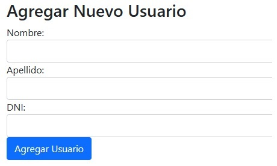
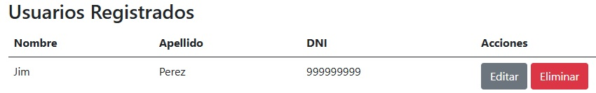
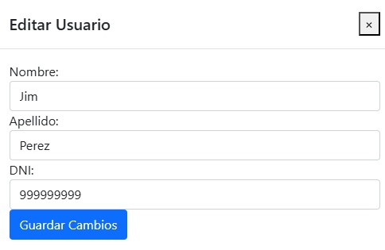

# User Management

## Descripción del Proyecto

Esta es una aplicación simple desarrollada con **.NET Core MVC** utilizando **Clean Architecture**. La plataforma permite gestionar una lista de usuarios, permitiendo realizar operaciones CRUD (Crear, Leer, Actualizar y Eliminar) para los usuarios. Cada usuario tiene las siguientes propiedades:

- **Nombre** (cadena de texto)
- **Apellido** (cadena de texto)
- **DNI** (cadena de texto)

La interfaz está desarrollada en MVC y permite realizar todas las operaciones CRUD en una sola vista centralizada.

## Tecnologías utilizadas

- .NET Core MVC
- Clean Architecture
- Entity Framework Core
- SQL Server (configurable para MySQL o MongoDB)
- Bootstrap 4 (para los estilos)

## Instrucciones para ejecutar el proyecto

### Requisitos previos

1. **.NET Core SDK**
2. **SQL Server**
3. **Visual Studio o Visual Studio Code**

### Configuración

1. Clonar el repositorio:

   git clone https://github.com/CodeWithJim/UserManagement.git

2. Ingresar al directorio del proyecto:

   cd UserManagement

3. Abrir el archivo `appsettings.json` dentro del proyecto `WebUI` y configurar la cadena de conexión para la base de datos (reemplazar "TU_SERVIDOR", comúnmente por "localhost"):

    "ConnectionStrings": {
        "DefaultConnection": "Server=TU_SERVIDOR;Database=UserManagementDB;Trusted_Connection=True;MultipleActiveResultSets=true;TrustServerCertificate=True;"
    }

4. Restaurar las dependencias del proyecto:

    dotnet restore

5. Ejecutar las migraciones para crear la base de datos:

    dotnet ef migrations add InitialMigration --project Infrastructure --startup-project WebUI
    dotnet ef database update --project Infrastructure --startup-project WebUI

6. Ejecutar la aplicación:

    dotnet run --project WebUI

7. Abrir el navegador e ingresar a:

    https://localhost:7032/

## Estructura del Proyecto

El proyecto sigue el patrón de **Clean Architecture**, dividiéndose en las siguientes capas:

- **WebUI**: Contiene la interfaz de usuario en ASP.NET Core MVC.
- **Application**: Contiene la lógica de negocio y los casos de uso para la gestión de usuarios.
- **Domain**: Contiene las entidades del dominio (en este caso, la entidad `User`).
- **Infrastructure**: Contiene la lógica de acceso a la base de datos, con el DbContext `ApplicationDbContext`.

### Casos de Uso Implementados

Se han implementado los siguientes casos de uso para los usuarios:

- **CreateUserUseCase**: Para crear un nuevo usuario.
- **GetUsersUseCase**: Para listar todos los usuarios.
- **UpdateUserUseCase**: Para actualizar la información de un usuario.
- **DeleteUserUseCase**: Para eliminar un usuario.

## Capturas de Pantalla

1. **Formulario de Creación de Usuario**

   

2. **Lista de Usuarios (Read)**

   

3. **Formulario de Actualización de Usuario**

   

4. **Eliminar Usuario**

   

## Consideraciones

- Se ha utilizado Bootstrap 4 para la interfaz y los modales de edición.
- Todas las operaciones CRUD se gestionan desde una única vista centralizada (`Views/Users/Index.cshtml`).

## Contacto

Si existiera alguna duda adicional, contactarme a través de mi correo: [contact@codewithjim.dev](mailto:contact@codewithjim.dev).
